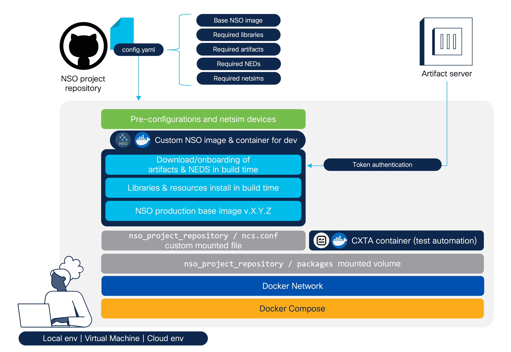
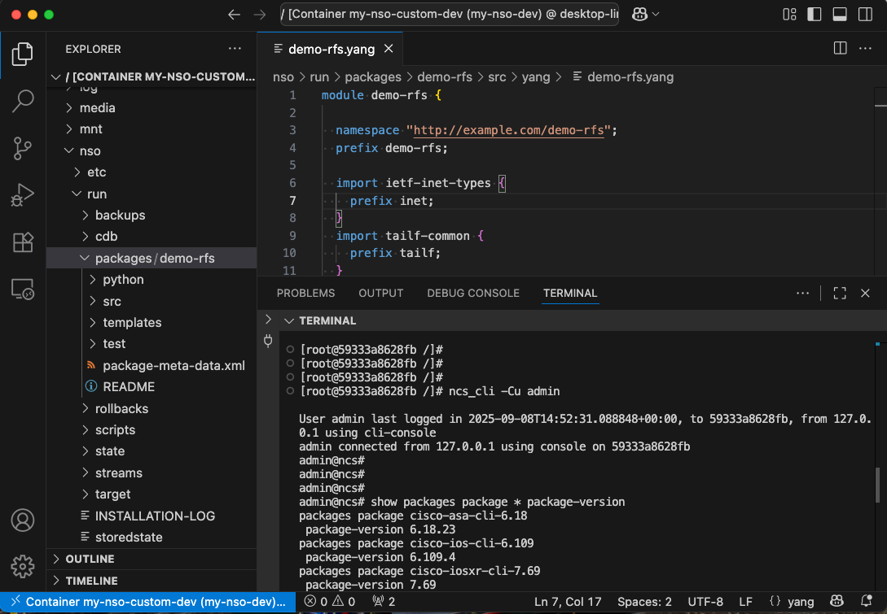

<h1 align="center">🛠️📦 NSO Consistent Development Environment
<div align="center">
  
  
  
  
</div></h1>

<div align="center">
A series of tools and recommendations for building standardized, container-based Cisco NSO environments tailored for Network Automation development projects.<br /><br />
</div>

## ✨ Overview
`(Based on real-life experiences)`. You join a Network Automation project with Cisco NSO, eager to start coding services right away. But first, you need your own setup to get that code flowing. Suddenly, you find yourself losing days wrangling with scattered docs, mismatched libraries, broken sources, and confusing steps just to piece your environment together. Instead of automating, you’re stuck troubleshooting, chasing quick fixes, and asking colleagues what worked for them.

With this in mind, this project collects a series of good practices and tooling to leverage the deployment of a Cisco NSO development environment in a versionable and swift way.

The following diagram shows the components of this project:



## 💡 Motivation
`🤝 Consistent development environment for everybody`

The development team works with the same `Cisco NSO versions`, `NEDs` and `regular packages/utilities (aka. artifacts)`. If there are changes in the requirements, these can be updated and versioned as code in the repository. 

`🚀 Build once, spin many`

The downloading of artifacts takes time. By building once, the same image can be used many times using docker-compose services, plus adding the required features such as ports, mounted volumes, ncs.conf, networks, etc.

`🚢 Fully based on the official NSO container image`

Without committing a new container image, the features of the official image are expanded and adapted to our project requirements. This means that we can operate our custom NSO image the same way as the official one (docker-compose integration, environment parameters, mounted volumes, startup, etc).

## 📁 Repository Structure
| File/Directory        | Description                                       |
| :-------------------- | :------------------------------------------------ |
| `config.yaml`         | Artifacts to download and packages to skip compilation |
| `docker-compose.j2`  | NSO and CXTA service definitions template                  |
| `Dockerfile.j2`          | Instructions template for custom NSO image building       |
| `Makefile`            | Build and orchestration commands                  |
| `ncs/ncs.conf`*        | Custom ncs.conf for your NSO container. Mounted in `/nso/etc`       |
| `packages/`           | Your versioned NSO packages. Mounted in `/nso/run/packages` |
| `setup/`              | Bash scripts for template rendering and custom NSO image building        |

*About the included `ncs/ncs.conf` file: It contains the configurations to mount two directories for the `NSO packages`:
* `/opt/ncs/packages` for the NEDs and artifacts in general
* `/nso/run/packages` for your custom services under development

This isolation keeps the environment clean, so you can focus on the services you are coding.

## 🐳 Docker Compose Services
The `docker-compose.yml` defines two key services:

*   **`my-nso-dev`**:
    Your custom NSO container, built from the `my-custom-nso` image. It mounts your `ncs.conf` and `packages` directory for development flexibility. It exposes NSO's WebUI on port `8080` and SSH/NETCONF on port `2022`.

*   **`my-cxta-dev`**:
    A CXTA container (`dockerhub.cisco.com/cxta-docker/cxta:latest`). It also mounts the `packages` directory for test automation.

> 💡 The `cxta` docker image is not available for public use. It needs to be acquired via Cisco services.

## 🚀 Getting Started

### Prerequisites
Ensure you have the following installed:
*   [Docker](https://docs.docker.com/get-docker/)
*   [Docker Compose](https://docs.docker.com/compose/install/)
*   [Make](https://www.gnu.org/software/make/)

> 💡 This project can only run in **Linux-based** environments. The project relies on `Makefile` targets for its operation, which are not compatible with Windows OS. 

### 1. Clone this repository
Issue the following command to clone this repository in your host computer or remote virtual machine intended to be your dev environment:

```bash
git clone https://github.com/ponchotitlan/nso-consistent-dev-environment.git
```

### 2. Download and install the official NSO Docker Image
> 💡 For this demo, we will be using the NSO Production Docker Image for Free Trial. If you already have a commercial-use image installed in your development environment, you can skip [to this part of the guide](https://github.com/ponchotitlan/nso-consistent-dev-environment/tree/main?tab=readme-ov-file#3-configure-requirementstxt).

The official NSO Docker Image is not available in any public container repository. Therefore, it needs to be manually downloaded from the Cisco Software Central and installed in your environment.

Navigate to the [Cisco Software Central - Crosswork Network Services Orchestrator Free Trial](https://software.cisco.com/download/home/286331591/type/286283941/release). Download the `Cisco Network Services Orchestrator Linux your_arch Production Docker Image`.

Once downloaded, unpack the contents of the signed file using this command:

```bash
sh nso-6.5-freetrial.container-image-prod.linux._your_arch_.signed.bin
```

Among the unpacked files, there should be a _.tar.gz_ file, which is the actual Docker Image. Onboard it in the Docker installation of your environment with the following command:

```bash
docker load < nso-6.5.container-image-prod.linux._your_arch_.tar.gz
```

The image should now be available in your environment. To verify, issue this command:

```bash
docker images | grep cisco-nso-prod
```

```bash
cisco-nso-prod                                    6.5       799772f04d48   4 months ago   1.59GB
```

### 3. Configure `requirements.txt`
Provide the python libraries that you need to have deployed in your development environment in the `requirements.txt` file. These will be later installed using `pip` during the building of the new image.

### 4. Configure `config.yaml`
Edit the `config.yaml` file to specify the following:

#### NSO fields
- `nso-base`
The NSO base image name:tag to use, as it appears in the `docker images` command.

- `nso-image`
The name of the new custom NSO container image.

- `nso-name`
The name of the NSO container when it is created.

#### CXTA fields
- `cxta-base`
The CXTA base image name:tag to use, as it appears in the `docker images` command.

- `cxta-name`
The name of the CXTA container when it is created.

#### Artifact fields
- `downloads`
The artifacts you wish to download during the image build. The URLs must point to the actual binaries in your artifact server

- `skip-compilation`
The artifacts that don't need to be compiled during the onboarding process. Ideally, all artifacts come already compiled, however there might be the case that you need to compile any in the container image building process.

> 💡 For this demo, we are using NEDs from the [Cisco Software Central - Crosswork Network Services Orchestrator Free Trial](https://software.cisco.com/download/home/286331591/type/286283941/release) already pre-loaded as releases in a public repository to emulate downloading from an Artifact Server.

```yaml
nso-base: cisco-nso-prod:6.5
nso-image: my-nso-custom-dev
nso-name: my-nso-dev

cxta-base: dockerhub.cisco.com/cxta-docker/cxta:latest
cxta-name: my-cxta-dev

downloads:
  - https://github.com/ponchotitlan/dummy_artefact_repository/releases/download/resourcemanager6.5/ncs-6.5-resource-manager-project-4.2.11.tar.gz
  - https://github.com/ponchotitlan/dummy_artefact_repository/releases/download/nx6.5/ncs-6.5-cisco-nx-5.27.3.tar.gz
  - https://github.com/ponchotitlan/dummy_artefact_repository/releases/download/iosxr6.5/ncs-6.5-cisco-iosxr-7.69.tar.gz
  - https://github.com/ponchotitlan/dummy_artefact_repository/releases/download/ios6.5/ncs-6.5-cisco-ios-6.109.4.tar.gz
  - https://github.com/ponchotitlan/dummy_artefact_repository/releases/download/asa6.5/ncs-6.5-cisco-asa-6.18.23.tar.gz

skip-compilation:
  - resource-manager
  - cisco-iosxr-cli-7.69
  - cisco-ios-cli-6.109
  - cisco-asa-cli-6.18
  - cisco-nx-cli-5.27
---
```

## 🛠️ Usage

The `Makefile` provides convenient commands to manage your custom NSO environment.

| Command | Description |
|---|---|
| `make` 🌟 | Default target: builds and then starts all services using the `render`, `register`, `build`, `run`, `compile` and `reload` targets.  |
| `make render` ✨ | Renders the templates `docker-compose.j2` and `Dockerfile.j2`. |
| `make register` 📤 | Mounts a local Docker registry for the NSO container image if your NSO base image is not registered anywhere. |
| `make build` 🏗️ | Builds the NSO custom Docker image with BuildKit secrets. |
| `make run` 🚀 | Starts Docker Compose services with health checks. |
| `make compile` 🛠️ | Compiles your services using the NSO container. |
| `make reload` 🔀 | Reloads all the services by running the `packages reload` command in the NSO container CLI. |
| `make down` 🛑 | Stops Docker Compose services. |

Example:

> 💡 **All the following commands are equivalent to just running `make`.** They are described individually here for documentation purposes. If you want to run everything at once, just type `make` and that's it.

### 1. Rendering the templates
```bash
make render
```

```bash
--- ✨ Rendering templates ---
```

The files `docker-compose.yml` and `Dockerfile` were just created in the root directory of this repository with the information provided in the `config/yaml` file.

> 💡 If your image is not hosted in a registry (it doesn't have a URL), the prefix `localhost:5000/` will be appended in all the rendered files

```bash
...
-- ✨ The image will be retagged as localhost:5000/cisco-nso-prod:6.5 in all the templates! --
```

### 2. Mounting a register container (only if your base NSO image is NOT hosted in any registry)
This step is necessary if you downloaded and onboarded the NSO free demo image in your host as mentioned in this README.

Nevertheless, if the image that you provided in the `config.yaml` file is already registered somewhere (aka. has a URL prefix), this step does nothing.

> 💡 This step is needed if your image is not hosted in a registry becauce otherwise it wouldn't be possible to use it in a Dockerfile. By default, docker tries to append a URL if the image name doesn't have one.

```bash
make register
```

```bash
--- 📤 Mounting local registry (if needed) ---
...
--- 📤 Starting local Docker registry on localhost:5000... ---
...
--- 📤 Tagging 'cisco-nso-prod:6.5' as 'localhost:5000/cisco-nso-prod:6.5'... ---
...
--- 📤 Pushing 'localhost:5000/cisco-nso-prod:6.5' to local registry... ---
...
--- 📤 Image pushed to local registry successfully. ---
```

Just to verify, the following command shows the active local registry container:

```bash
% docker ps | grep registry
f8f892c7cd3b   registry:2   "/entrypoint.sh /etc…"   10 minutes ago   Up 10 minutes   0.0.0.0:5000->5000/tcp   local-registry
```

### 3. Building your custom NSO image
```bash
make build
```

```bash
--- 🏗️ Building NSO custom image with BuildKit secrets ---
...
🔑 Enter your username and artifact server token in this format ➡️ username:token (or hit Enter if not required):
...
[+] Building 0.7s (20/20) FINISHED
```

The credentials are stored in a safe file (which will later be deleted) and mounted in the image in build time. These credentials are used to download your artifacts enlisted in `config.yaml`. If the credentials format is incorrect, the script will raise an error and stop.

Your artifacts are downloaded and extracted in `opt/ncs/packages`. Your image is ready to be used!

To verify, use the following command with the name provided in the `config.yaml` file:

```bash
% docker images | grep my-nso-custom-dev
my-nso-custom-dev                      latest    f868374843d7   2 minutes ago   1.79GB
```

> 💡 Note that if you create containers based on this image, it will not download anything unless the list in `config.yaml` changes. This saves plenty of time and effort when spinning up new containers.

### 4. Running your Docker Compose services
```bash
make run
```

```bash
--- 🚀 Starting Docker Compose services ---
[+] Running 2/2
 ✔ Container my-cxta-dev  Running
 ✔ Container my-nso-dev   Started  
...
⌛️ Waiting for my-nso-dev to become healthy...
[🐋💤] Waiting for 'my-nso-dev' to become healthy (current status: "starting")...
...
[🐋] my-nso-dev is healthy and ready!
```

```bash
make compile
```

```bash
--- 🛠️ Compiling your services ---
...
[📦] Compiling package (demo-rfs) from directory (/nso/run/packages) ...
...
[🛠️] Compiling done!
```

All the services from your `packages/` location are properly compiled now.

```bash
make reload
```

```bash
--- 🔀 Reloading the services ---
...
{
    package cisco-asa-cli-6.18
    result true
}
reload-result {
    package cisco-ios-cli-6.109
    result true
}
reload-result {
    package cisco-iosxr-cli-7.69
    result true
}
reload-result {
    package cisco-nx-cli-5.27
    result true
}
reload-result {
    package demo-rfs
    result true
}
reload-result {
    package resource-manager
    result true
}
reload-result {
    package cisco-asa-cli-6.18
    result true
}
reload-result {
    package cisco-ios-cli-6.109
    result true
}
reload-result {
    package cisco-iosxr-cli-7.69
    result true
}
reload-result {
    package cisco-nx-cli-5.27
    result true
}
reload-result {
    package demo-rfs
    result true
}
reload-result {
    package resource-manager
    result true
}
```

**✅ Your environment is ready for use!** You can verify your containers with the following command:

`docker ps`

```bash
% docker ps
CONTAINER ID   IMAGE                                         COMMAND                  CREATED        STATUS                    PORTS                                            NAMES
a5ee6114e149   my-nso-custom-dev                             "/run-nso.sh"            17 hours ago   Up 11 minutes (healthy)   0.0.0.0:2022->2022/tcp, 0.0.0.0:8080->8080/tcp   my-nso-dev
76f4de91d18c   dockerhub.cisco.com/cxta-docker/cxta:latest   "/docker-entrypoint.…"   17 hours ago   Up 12 minutes                                                              my-cxta-dev
f8f892c7cd3b   registry:2                                    "/entrypoint.sh /etc…"   17 hours ago   Up 16 minutes             0.0.0.0:5000->5000/tcp                           local-registry
```

✅ Also, you can verify the deployment of your artifacts, NEDs and services:

```bash
% docker exec my-nso-dev /bin/bash -c "echo 'show packages package * oper-status | tab' | ncs_cli -Cu admin"
                                                                                                        PACKAGE                          
                          PROGRAM                                                                       META     FILE                    
                          CODE     JAVA           PYTHON         BAD NCS  PACKAGE  PACKAGE  CIRCULAR    DATA     LOAD   ERROR            
NAME                  UP  ERROR    UNINITIALIZED  UNINITIALIZED  VERSION  NAME     VERSION  DEPENDENCY  ERROR    ERROR  INFO   WARNINGS  
-----------------------------------------------------------------------------------------------------------------------------------------
cisco-asa-cli-6.18    X   -        -              -              -        -        -        -           -        -      -      -         
cisco-ios-cli-6.109   X   -        -              -              -        -        -        -           -        -      -      -         
cisco-iosxr-cli-7.69  X   -        -              -              -        -        -        -           -        -      -      -         
cisco-nx-cli-5.27     X   -        -              -              -        -        -        -           -        -      -      -         
demo-rfs              X   -        -              -              -        -        -        -           -        -      -      -         
resource-manager      X   -        -              -              -        -        -        -           -        -      -      -         
```

✅ Your artifacts and NEDs are in a different location:

```bash
% docker exec my-nso-dev /bin/bash -c "ls -lh /opt/ncs/packages"                                            
total 20K
drwxr-xr-x  8 9001 users 4.0K May 15 09:00 cisco-asa-cli-6.18
drwxr-xr-x  8 9001 users 4.0K May  8 12:20 cisco-ios-cli-6.109
drwxr-xr-x  9 9001 users 4.0K May  8 11:23 cisco-iosxr-cli-7.69
drwxr-xr-x  9 9001 users 4.0K May 13 09:31 cisco-nx-cli-5.27
drwxr-xr-x 11 root root  4.0K Sep  8 15:42 resource-manager
```

✅ Your services under development are in this mounted volume, mapped to your repository:
```bash
% docker exec my-nso-dev /bin/bash -c "ls -lh /nso/run/packages"
total 0
drwxr-xr-x 8 nso root 256 Sep  2 15:44 demo-rfs
```

### 5. Accesing your environment
If you are using the Visual Studio IDE, you can [attach your IDE to your NSO running container](https://code.visualstudio.com/docs/devcontainers/attach-container) and use it like if it was your local environment.



Given that your working services are mounted in a volume, any changes done will reflect in your local repository. Therefore, you can commit and push changes when you release a new version of your services.

### 6. Destroying your environment
```bash
make down
```

```bash
--- 🛑 Stopping Docker Compose services ---
docker compose down
[+] Running 3/3
 ✔ Container my-cxta-dev                             Removed              10.1s 
 ✔ Container my-nso-dev                              Removed               1.5s 
 ✔ Network nso-consistent-dev-environment_dev-netwk  Removed               0.2s 
```

All your services are gone now.

## 🔥 Troubleshooting

`⚠️ Why is my NSO container taking too long to become healthy?`

Depending on the amount of artifacts and services, the initial `packages reload force` of the container might take a while. To verify the progress, you can open the logs of your container in persistent mode:

```bash
docker logs -f my_nso_container_name
```

`⚠️ Why sometimes my NSO container fails to become healthy?`

During boot (`packages reload force`), it can happen that this error is shown and the booting process is halted:

```bash
[🐋🔥] Error: Container 'my-nso-dev' stopped or exited unexpectedly during boot.
```

It has been seen that the behaviour `of the NSO container image on Mac hosts with m-family chips is unstable`. This behaviour has been spotted up to the version v6.5 in this kind of host, even when the Docker resources have ben maxed to the limit.

It is recommended to either bring down the environment (`make down`) and bring it up again (`make run`) several times until the container comes up gracefully, or opt for a different host environment.

A dedicated linux-based VM or cloud environment should provide a stable behaviour for the NSO container booting.

## 🔮 Future work

- Onboarding of this framework in a cloud-based environment for on demand creation without any host nor VM (ex. GitHub Codespaces)

---

<div align="center"><br />
    Made with ☕️ by Poncho Sandoval - <code>Developer Advocate @ DevNet - Cisco Systems 🇵🇹</code><br /><br />
    <a href="mailto:alfsando@cisco.com?subject=Question%20about%20[NSO%20Consistent%20Dev%20Env]&body=Hello,%0A%0AI%20have%20a%20question%20regarding%20your%20project.%0A%0AThanks!">
        
    </a>
    <a href="https://github.com/ponchotitlan/nso-consistent-dev-environment/issues/new">
      
    </a>
    <a href="https://github.com/ponchotitlan/nso-consistent-dev-environment/fork">
      
    </a>
</div>